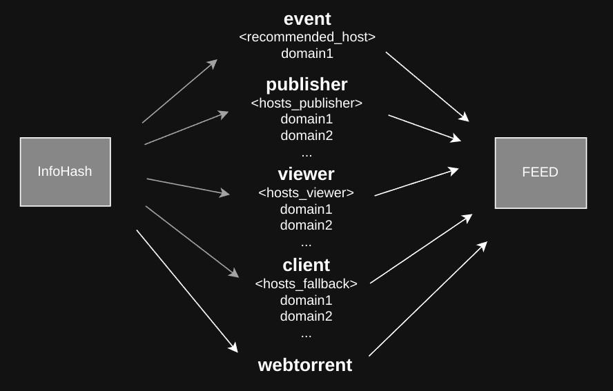

# Media Files

# Table of Contents

1. [Overview](#overview)
1. [NIPs](#nips)
1. [Naming convention](#naming-convention)
1. [Torrent](#torrent)
    * [Torrent file piece length](#torrent-file-piece-length)
    * [Torrent file name](#torrent-file-name)
    * [Media files metadata](#media-files-metadata)
1. [Event](#event)
    * [Upload a media file](#upload-a-media-file)
    * [Reference a media event](#reference-a-media-event)
1. [Default hosts](#default-hosts)
    * [Timestamp](#timestamp)
    * [Hash kind](#hash-kind)
1. [Hosts](#hosts)
    * [Find a host with a media file](#find-a-host-with-a-media-file)
    * [Why hosts_viewer are needed?](#why-hosts_viewer-are-needed)
1. [Other notes](#other-notes)
    * [Custom previews](#custom-previews)
    * [Why IPFS is not a default hash](#why-ipfs-is-not-a-default-hash)
1. [Feedback](#feedback)

`draft` `optional` `author:lovvtide(Stuart Bowman)` `author:degenrocket`

## Overview

At the time of writing, a Nostr protocol has limitations that stop developers from implementing a user-friendly and censorship-resistant way of sharing media files such as audio, video, and images.

This documentation describes the process of distributing media files using infohashes as identifiers.

In order to implement the infohash-based approach, participants of a Nostr protocol must achieve consensus on the use of several optional tags that will hold infohash and filetype values, as well as a new event kind reserved for the creation of an infohash.

An infohash tag **must** be indexed for easy filter queries, so a single-letter tag **must** be used.

A filetype tag should ideally be indexed for easy filter queries, so a single-letter tag is prefered as well. *Note: feedback is needed.* 

A new event kind must be reserved for the creation of an infohash.

Two new tags and one new kind can be proposed in one NIP or in separate NIPs. Even if consensus on the use of a new tag and a new kind specific for infohashes won't be achieved, a Nostr community can benefit by adding only a new indexed single-letter tag to specify a filetype, allowing users to request media based on a file type (audio, video, image).

[<- back to table of contents](#table-of-contents)

---

## NIPs

We propose the following changes within one or multiple separate NIPs.

New tags:

- an `x` tag to include varios hashes of media files in order to allow users to play media files on a client.

- an `m` tag to indicate file types of uploaded files.

New kind:

- a kind `2001` event to describe identifiers (hashes) and other properties of a media file that can be used within the Nostr protocol.

[<- back to table of contents](#table-of-contents)

---

## Naming convention

`user-publisher` or `publisher` - a user who uploads a media file and signs an event.

`user-viewer` or `viewer` - a user who fetches a media file.

`client-publisher` - a client used by a user who uploads a media file.

`client-viewer` - a client used by a user who fetches a media file.

`host` - an end point that hosts media files and allows fetching.

`recommended_host` - a recommended host by a user-publisher in a posting event.

`hosts_publisher` - default hosts specified by a `user-publisher` from where media files posted by a `user-publisher` can be fetched.

`hosts_viewer` - default hosts specified by a `user-viewer` from where media files posted by a `user-publisher` can potentially be fetched.

`hosts_fallback` - fallback hosts hardcoded by the `client-viewer`.

[<- back to table of contents](#table-of-contents)

---

## Multiple hashes

[Discussion: restructuring tags to support multiple hashes for content addressing](https://github.com/lovvtide/nostr-torrent/issues/3)

While `torrent` (infohash) is a recommended identifier for media files within the Nostr protocol, other hashes can be used under a media tag (`x`) in the media event (kind `2001`).

Here is an example of a media event with `torrent` and `ipfs` hashes.

```
{
    "created_at": 1679552101,
    "content": "",
    "kind": 2001,
    "tags": [
        [
            "x", 
            "a19a70552cc801415a6071993c04b3ab21572438",
            "torrent",
            "https://media.satellite.earth/torrent"
        ],
        [
            "x",
            "bafybeia7fsunya52qm2ov3wqtrv2andjjk3nqo273a3clpm76roypqgefq",
            "ipfs",
            "https://ipfs.io/ipfs"
        ],
        [
            "m",
            "video/mp4"
        ],
        [
            "name",
            "Watts.mp4"
        ],
        [
            "size",
            "26685219"
        ]
    ],
    "pubkey": "fbd992dbccdd4186f4ef25b7d72ea47387a59227493f8569b17963afae4e4d33",
    "id": "faea2a5dbe12c877c1201e91ec909e3161a1ba8714fdca4d3077f6d4b0780191",
    "sig": "10c0d634ea0b9ae085205c3951367da784268a0cdf4a18b969aba7c06b1a59abf96b7f5f4e2d3791389dff71ff5527c33e3405e8decad9b3e4419406124dc46a"
}
```

[<- back to table of contents](#table-of-contents)

---

## Torrent

Torrent's hash is called an `infohash`, which is a SHA1 hash over the part of a torrent file.

### Torrent file piece length

The torrent protocol doesn't specify an optimal piece length, which can cause issues with infohashes not matching each other across different implementations.

When computing infohashes on a client and a server, the same algorithm should be used to generate the piece length to ensure that infohashes stay consistent.

Here is a javascript reference implementation of the algorithm.

```
function length (bytes) {
  return Math.max(16384, 1 << Math.log2(bytes < 1024 ? 1 : bytes / 1024) + 0.5 | 0)
}
```

*Note: since the algorithm will be a part of the NIP to ensure that piece length is deterministically generated and consistent over different webtorrent versions, `plen` can be removed from the event json. On the other side, an algorithm might change in the future, so keeping a `plen` field will help ensure backward compatibility. (feedback is needed)*

### Torrent file name

[Discussion: Nostrhash](https://github.com/lovvtide/nostr-torrent/issues/4)

Right now an infohash depends on the `name` field, meaning that exactly the same file uploaded by two users will produce two different infohashes if such files have a different name. Ideally, the same file should produce the same infohash regardless of the name.

There are different approaches to achieve consensus starting from using an empty string as a name of a file to hashing the content of a torrent file with SHA1 and using the hash as a name.

The latest decision is to set a torrent file name to be equal to the `name` tag of the media event (kind `2001`), meaning that the same file can be potentially uploaded with different names and have different `torrent` (infohash).

### Media files metadata

```
{
	'name': <string>
	'length': <integer>
	'piece length': <integer>
	'pieces': [ <chunk_hash>, <chunk_hash>, ... ]
}
```

[<- back to table of contents](#table-of-contents)

---

## Event

### Upload a media file

```
{
  "id": <32-bytes lowercase hex-encoded sha256 of the serialized event data>,
  "pubkey": <32-bytes lowercase hex-encoded public key of the event creator>,
  "created_at": <timestamp>,
  "content": "",
  "kind": <integer>,
  "tags": [
    ["x", <infohash>, <hash_kind>, <recommended_host>],
    ["m", <mimetype>],
    ["name", <filename>],
    ["size", <bytelength>],
    ["plen", <bytelength_of_piece>] (optional)
  ],
  "sig": <signature>
}
```

Example:

```
{
    "created_at": 1679552101,
    "content": "",
    "kind": 2001,
    "tags": [
        [
            "x", 
            "a19a70552cc801415a6071993c04b3ab21572438",
            "torrent",
            "https://media.satellite.earth/torrent"
        ],
        [
            "x",
            "bafybeia7fsunya52qm2ov3wqtrv2andjjk3nqo273a3clpm76roypqgefq",
            "ipfs",
            "https://ipfs.io/ipfs"
        ],
        [
            "m",
            "video/mp4"
        ],
        [
            "name",
            "Watts.mp4"
        ],
        [
            "size",
            "26685219"
        ]
    ],
    "pubkey": "fbd992dbccdd4186f4ef25b7d72ea47387a59227493f8569b17963afae4e4d33",
    "id": "faea2a5dbe12c877c1201e91ec909e3161a1ba8714fdca4d3077f6d4b0780191",
    "sig": "10c0d634ea0b9ae085205c3951367da784268a0cdf4a18b969aba7c06b1a59abf96b7f5f4e2d3791389dff71ff5527c33e3405e8decad9b3e4419406124dc46a"
}
```

The client can pull the metadata for torrents referenced in any event, the id of the torrent needs to be added as an `e` tag to the tags array of the event that is referencing it.


### Reference a media event

[Discussion: reference a media hash in the text note (kind 1) event](https://github.com/lovvtide/nostr-torrent/issues/2)

For text note events that contain a link to a file represented by a media event (kind 2001), it's recommended to include the id of the media event (kind 2001) as an `e` tag of the text note (kind 1) event.

```
{
    "id":"faea2a5dbe12c877c1201e91ec909e3161a1ba8714fdca4d3077f6d4b0780191",
    "content":"https://media.satellite.earth/a19a70552cc801415a6071993c04b3ab21572438\n\nMy video captions, whatever",
    "created_at":1679552101,
    "kind":1,
    "pubkey":"fbd992dbccdd4186f4ef25b7d72ea47387a59227493f8569b17963afae4e4d33",
    "sig":"10c0d634ea0b9ae085205c3951367da784268a0cdf4a18b969aba7c06b1a59abf96b7f5f4e2d3791389dff71ff5527c33e3405e8decad9b3e4419406124dc46a",
    "tags":[
        [
            "e", "cb657467b824fe8b0f4a7d7db6380e30340b18c03ab14e56849d59c85435628a"
        ]
    ]
}
```

[<- back to table of contents](#table-of-contents)

---

## Default hosts

[Discussion: should a hash kind be specified in a recommended host URL](https://github.com/lovvtide/nostr-torrent/issues/5)

Default hosts (`hosts_viewer` and `hosts_publisher`) can be updated with kind `0` event.

```
{
	relays: [
		{ url: <wss://whatever>, read: true, write: true },
		{ url: <wss://whatever>, read: true, write: true },
		...
	],
	hosts_publisher: [
    		{ url: <media.domain.com>, timestamp: <integer>, hash_kind: <string> (optional) },
    		{ url: <media.domain.org>, timestamp: <integer>, hash_kind: <string> (optional) },
		...
	],
	hosts_viewer: [
    		{ url: <media.domain.com>, timestamp: <integer>, hash_kind: <string> (optional) },
    		{ url: <media.domain.org>, timestamp: <integer>, hash_kind: <string> (optional) },
		...
	]
}
```

### Timestamp

Since `hosts_publisher` are account-specific and not file-specific, there is no easy way to determine on which host the media file is being stored. However, a `user_publisher` might have many `hosts_publisher` specified in his metadata. Thus, a timestamp is needed to allow a `client_viewer` to easily find a host that was most likely used when a media file was uploaded.

Without a timestamp, a `client_viewer` would have to request media files from all `hosts_publisher`, which can become a problem over time as a `user_publisher` doesn't have an incentive to delete old `hosts_publisher`.

### Hash kind

A hash kind is an optional key with values like `any`, `torrent`, `ipfs`, etc., which gives an advanced user an ability to specify different default hosts/endpoints for different hash kinds.

If a `hash_kind` is not specified, then a client will assume that a default host serves media files of any hash kind.

In most cases, clients will set a `hash_kind` to `any`, so UX won't degrade. However, advanced users will be able to manually set unique host/endpoint for each `hash_kind`.

[<- back to table of contents](#table-of-contents)

---

## Hosts

### Find a host with a media file



`recommended_host`
- A `user_publisher` can optionally specify a recommended host in event's tags array, e.g. `["x", <infohash>, <recommended_host>]`

`hosts_publisher`
- If a recommended host is not included in the event, a client can try to fetch a media file from a list of `hosts_publisher` specified in profile settins of a `user_publisher` with a kind `0` event (`set_metadata`).

`hosts_viewer`
- If a recommended host is not included in the event, a client can try to fetch a media file from a list of user's default hosts (`hosts_viewer`) specified in his profile settings with a kind `0` event (`set_metadata`).

`hosts_fallback`
- A client can specify default fallback hosts.
- If an infohash is not found on publisher's or user's default hosts, a user can ask relays 

`webtorrent`
- If an infohash is not found on any host, a user can use an infohash as webtorrent's magnet link to fetch the video using torrents.

### Why `hosts_viewer` are needed?

Some paid hosts might choose a business modal of downloading all popular media files so they can store the content and provide a high and reliable download speed.


[<- back to table of contents](#table-of-contents)

---

## Other notes

### Custom previews

A `user_publisher` can upload a custom thumbnail as an infohash event (kind 2001) and then reference it in another infohash event (kind 2001) to upload a video.

### Why IPFS is not a default hash?
- Infohash (torrent) and IPFS hashes use different hashing algorithms.
- IPFS hash cannot be derived from the infohash, so the whole media file must be re-downloaded in order to generate an IPFS hash.
- IPFS libraries are heavy.
- Different versions of IPFS use different hashing algorithms.
- An `IPFS` hash can still be used as an identifier under an `x` tag in the media event (kind `2001`).

[<- back to table of contents](#table-of-contents)

---

### Feedback

**Stuart Bowman**

https://github.com/lovvtide

[https://twitter.com/stuartbowman_](https://twitter.com/stuartbowman_)

https://satellite.earth/

nostr: npub1lunaq893u4hmtpvqxpk8hfmtkqmm7ggutdtnc4hyuux2skr4ttcqr827lj


---

**degenrocket**


https://github.com/degenrocket

https://degenrocket.space

nostr: npub1kwnsd0xwkw03j0d92088vf2a66a9kztsq8ywlp0lrwfwn9yffjqspcmr0z


[<- back to table of contents](#table-of-contents)

---
